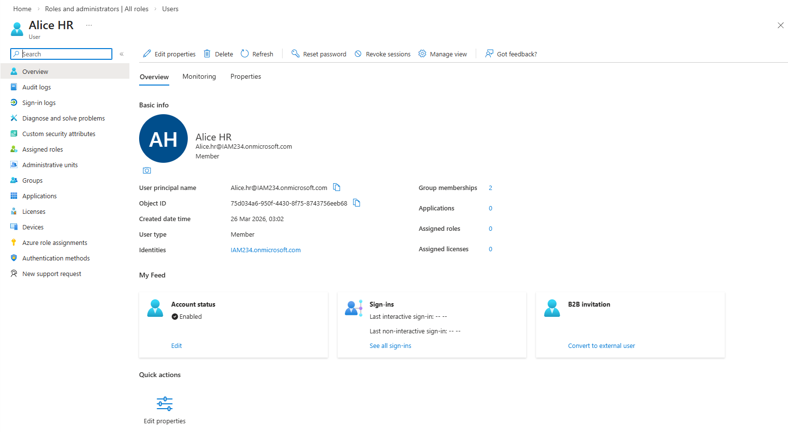
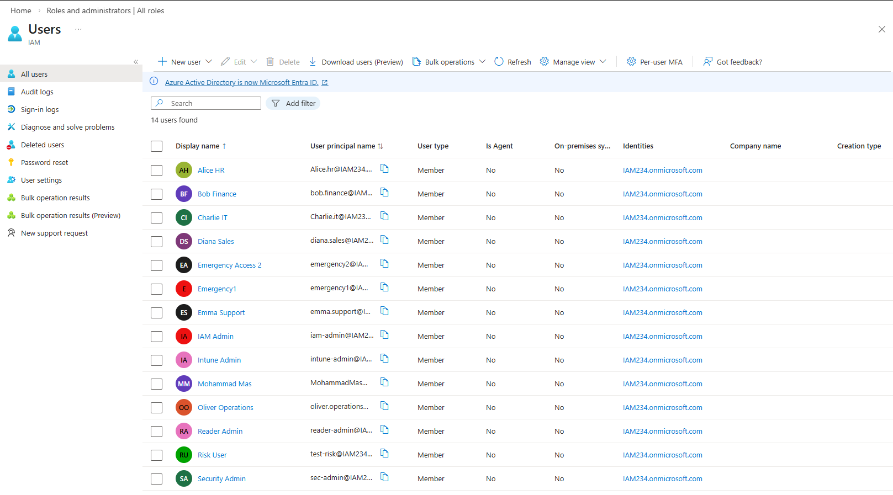
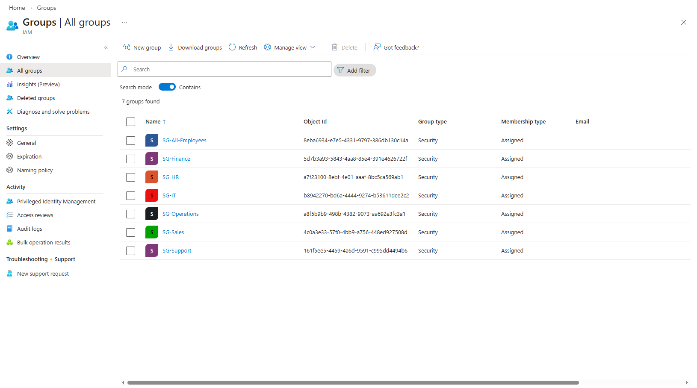
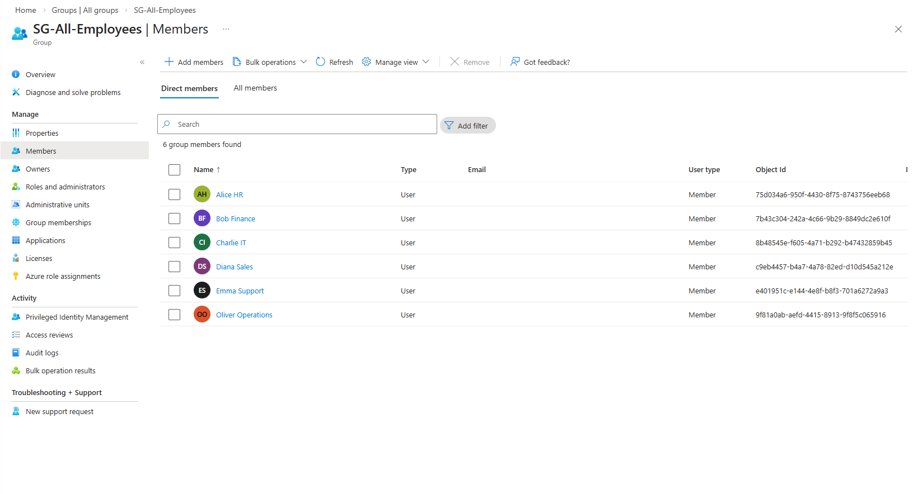
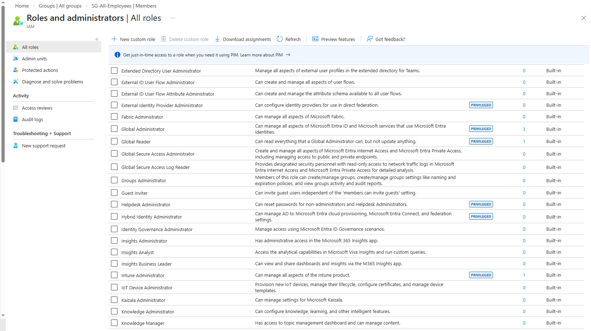
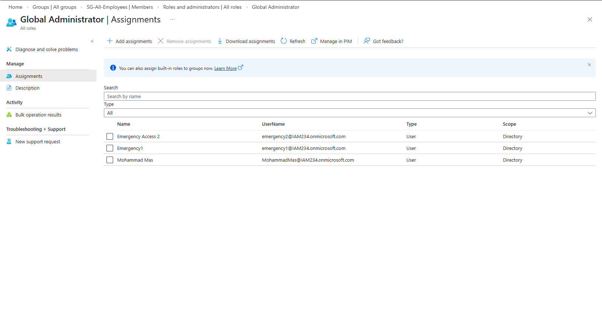
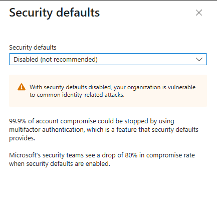

# Phase 2 – Tenant Foundation

## Objective

Establish a secure and structured Microsoft Entra ID tenant for the Northstar Health IAM lab, forming the foundation for identity, access control, and security design across all subsequent phases.

This phase focuses on:

* Identity separation (workforce vs admin vs emergency)
* Group-based organizational structure
* Least-privilege role assignment
* Emergency access (break-glass) design
* Initial tenant hardening decisions

---

## Environment Context

* Organization: Northstar Health
* Industry: Healthcare Technology
* Locations: London (HQ), Manchester, Remote UK workforce
* IAM Platform: Microsoft Entra ID
* Architecture: Cloud-native only
* Security Model: Zero Trust aligned
* Cost Model: Free-first / minimal cost

---

## Tenant Naming Note

The Microsoft Entra tenant was created using the domain:

`iam.onmicrosoft.com`

For the purpose of this lab, the tenant represents the organization **Northstar Health**.

In real-world environments, tenant domains do not always align with company branding due to legacy decisions, early provisioning constraints, or mergers. This lab intentionally retains the existing tenant name to reflect realistic IAM conditions.

---

## Design Principles

The tenant foundation was built using the following IAM principles:

* Least privilege access
* Separation of duties
* Identity isolation (user vs admin vs emergency)
* Group-based access control
* No single points of failure
* Design for recoverability

---

## Naming Conventions

### Users

| Type      | Format                      | Example     |
| --------- | --------------------------- | ----------- |
| Workforce | firstname.department@domain | alice.hr@   |
| Admin     | role-admin@domain           | iam-admin@  |
| Emergency | emergencyX@domain           | emergency1@ |
| Test      | test-risk@domain            | test-risk@  |

---

### Groups

| Type           | Format           | Example          |
| -------------- | ---------------- | ---------------- |
| Security Group | SG-<Name>        | SG-HR            |
| Global Group   | SG-All-Employees | SG-All-Employees |

---

## User Inventory

### Workforce Users

* alice.hr@
* bob.finance@
* charlie.it@
* diana.sales@
* emma.support@
* oliver.operations@

These users represent typical employees and are used for normal access scenarios.

---

### Privileged Admin Users

* iam-admin@
* sec-admin@
* intune-admin@
* reader-admin@

These accounts are:

* Separate from workforce identities
* Not used for daily productivity
* Used only for administrative actions

---

### Emergency Access Accounts

* emergency1@
* emergency2@

These accounts are:

* Cloud-only
* Not tied to individuals
* Reserved strictly for tenant recovery scenarios
* Not used in normal operations

---

### Test User

* test-risk@

This account is used for:

* Policy testing
* Risk simulations
* Safe validation of future configurations

---

## Group Inventory

The following security groups were created:

* SG-HR
* SG-Finance
* SG-IT
* SG-Sales
* SG-Support
* SG-Operations
* SG-All-Employees

All groups were created as **Security groups with assigned membership**.

Role assignment capability for groups was intentionally disabled to maintain clarity in privilege assignment during early phases.

---

## Group Ownership

All groups are owned by:

* iam-admin@

This ensures:

* Centralized identity governance
* Clear accountability
* Consistent access management

---

## Group Membership

### Department Mapping

| User               | Group         |
| ------------------ | ------------- |
| alice.hr@          | SG-HR         |
| bob.finance@       | SG-Finance    |
| charlie.it@        | SG-IT         |
| diana.sales@       | SG-Sales      |
| emma.support@      | SG-Support    |
| oliver.operations@ | SG-Operations |

---

### Global Group

All workforce users are members of:

* SG-All-Employees

Admin and emergency accounts are intentionally excluded.

---

## Role Assignments

The following least-privilege roles were assigned:

| Account       | Role                   |
| ------------- | ---------------------- |
| iam-admin@    | User Administrator     |
| sec-admin@    | Security Administrator |
| intune-admin@ | Intune Administrator   |
| reader-admin@ | Global Reader          |

### Design Decision

Global Administrator was not broadly assigned.

Administrative responsibilities are distributed across scoped roles to reduce risk and enforce least privilege.

---

## Emergency Access Design

Two emergency access accounts were implemented to prevent tenant lockout and ensure recoverability.

### Design Principles

* Two accounts to eliminate single point of failure
* High privilege for recovery scenarios
* No daily usage
* No group membership
* Not tied to specific individuals
* Credentials stored securely

### Future Considerations

These accounts will:

* Be excluded from Conditional Access policies
* Be monitored through sign-in logs
* Be adapted to support modern authentication requirements where necessary

---

## Tenant Hardening Decision

### Security Defaults

Security Defaults were intentionally left **disabled** in this phase.

### Reasoning

This lab follows a phased IAM implementation approach. Authentication controls and Conditional Access policies will be introduced in later phases.

Enabling Security Defaults at this stage would:

* Limit flexibility for Conditional Access design
* Prevent proper modeling of emergency access exclusions
* Introduce rigid controls before authentication architecture is defined

This is a **temporary lab decision**, not a recommended enterprise end-state.

---

## Validation Performed

The following checks were completed:

* All required users were created
* All groups were created successfully
* Workforce users assigned to correct groups
* SG-All-Employees contains only workforce users
* Admin and emergency accounts excluded from employee groups
* Role assignments verified
* Emergency accounts confirmed and isolated
* Security Defaults status verified

---

## Failure Scenarios Considered

* Admin accounts mixed with workforce identities → increased compromise risk
* Overuse of Global Administrator → excessive privilege exposure
* Single emergency account → recovery failure risk
* Emergency accounts used daily → loss of recovery integrity
* Admin accounts added to SG-All-Employees → unintended privilege spread

---

## Key Lessons Learned

* The Entra tenant is the core identity security boundary
* Identity separation is critical for reducing blast radius
* Least privilege must be implemented from the start
* Emergency access must be designed deliberately
* Group-based access simplifies scaling and governance
* IAM design requires balancing security, usability, and recoverability

---

## Phase Outcome

At the end of this phase, the tenant has:

* A structured identity model
* Clear separation of identity types
* Group-based organization
* Least-privilege administrative model
* Emergency recovery capability

This foundation enables secure progression into authentication, Conditional Access, and governance in later phases.

