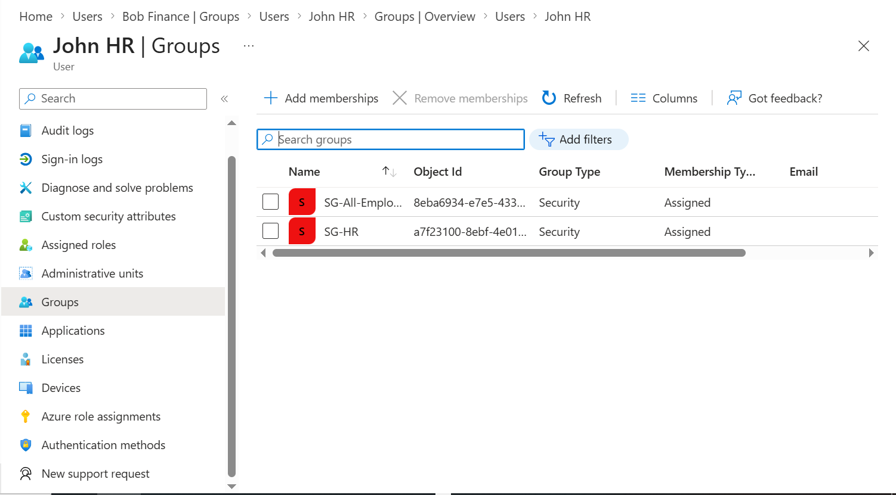
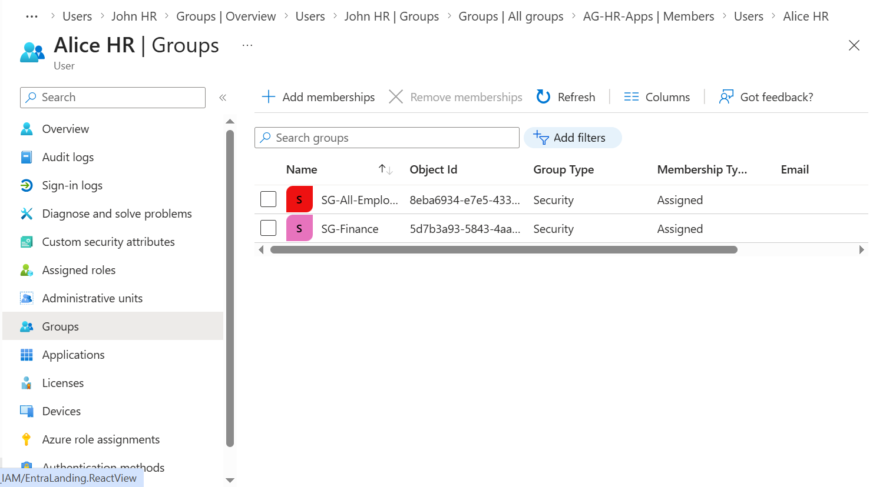
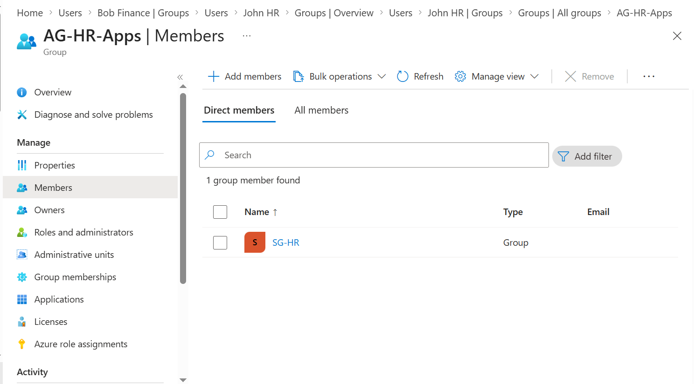
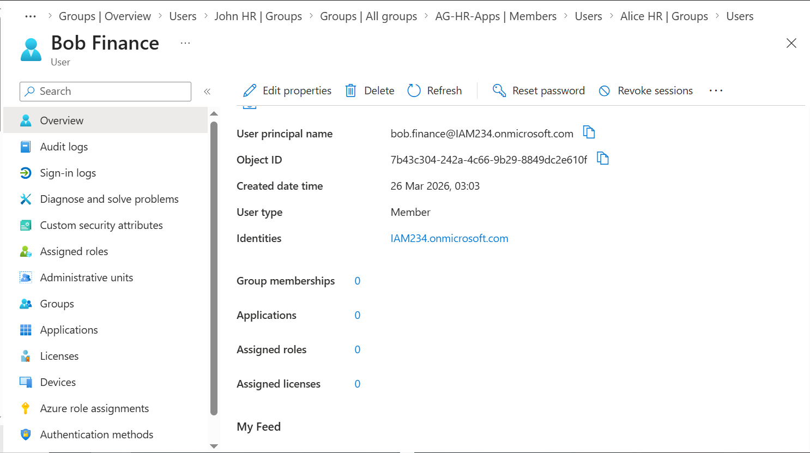

# Phase 4 – Identity Lifecycle (Joiner, Mover, Leaver)

## Objective

Design and validate a structured identity lifecycle model for the Northstar Health IAM lab using Microsoft Entra ID.

This phase focuses on ensuring that user access is dynamically controlled through group membership, enabling consistent onboarding, controlled role changes, and secure offboarding.

---

## Environment Context

* Organization: Northstar Health
* IAM Platform: Microsoft Entra ID
* Architecture: Cloud-native only
* Access Model: Group-based (SG → AG → Resource)
* Lifecycle Goal: Automate access through identity changes

---

## Problem Statement

Without a defined lifecycle model:

* users retain unnecessary access
* onboarding becomes inconsistent
* offboarding becomes a security risk
* privilege creep increases over time

To prevent this, identity lifecycle must be governed through structured processes that rely on group membership rather than direct permission assignment.

---

## Lifecycle Model Overview

The lifecycle model is based on three core events:

```text
Joiner → Mover → Leaver
```

These events control how access is granted, modified, and removed.

---

## Core Principle

Access is not assigned directly to users.

Instead:

```text
User → SG-* → AG-* → Resource
```

Lifecycle changes are performed by modifying group membership only.

---

## Joiner Process

### Scenario

A new employee joins the HR department.

### Implementation

A new user account was created:

* john.hr@
* Display name: John HR
* Department: HR

The user was assigned to:

* SG-HR
* SG-All-Employees



---

### Access Flow

```text
john.hr@ → SG-HR → AG-HR-Apps → Resource
```

No direct permissions were assigned to the user.

---

### Validation

* John appears in SG-HR
* SG-HR is nested inside AG-HR-Apps
* Access path is established via group membership

---

### Failure Scenario

If group membership is not assigned:

* the user receives no access
* onboarding fails

---

### Lesson

Joiner access must be driven by group assignment, not manual permission allocation.

---

## Mover Process

### Scenario

An existing employee changes department from HR to Finance.

### Implementation

User: alice.hr@

Changes applied:

* Removed from SG-HR
* Added to SG-Finance



---

### Access Flow

Before:

```text
alice.hr@ → SG-HR → AG-HR-Apps
```

After:

```text
alice.hr@ → SG-Finance → AG-Finance-Apps
```


---

### Validation

* Alice is no longer a member of SG-HR
* Alice is now a member of SG-Finance
* Access is updated automatically through group nesting

---

### Failure Scenario

If the original group is not removed:

* user retains both HR and Finance access
* leads to privilege creep

---

### Lesson

Mover events are the primary cause of over-permissioning in real environments and must be handled carefully.

---

## Leaver Process

### Scenario

An employee leaves the organization.

### Implementation

User: bob.finance@

Actions performed:

* Sign-in blocked
* Removed from all group memberships (optional but recommended)
* Account retained for audit purposes



---

### Validation

* User cannot sign in
* No group-based access remains
* Account remains available for audit and logging

---

### Failure Scenario

If the account is not disabled:

* the user may retain access after leaving

If the account is deleted immediately:

* audit logs and traceability are lost

---

### Lesson

Accounts should be disabled immediately upon departure and deleted only after an appropriate retention period.

---

## Lifecycle Validation Summary

The lifecycle model was validated through the following checks:

* Joiner receives access via group assignment
* Mover access updates automatically through group changes
* Leaver access is removed via account disablement
* No direct permission assignments were required

---

## Design Decisions

### Group-Based Lifecycle Control

All lifecycle changes were performed through SG-* group membership.

This ensures:

* consistency
* scalability
* reduced manual effort
* alignment with automation

---

### No Direct User Permissions

Users were not assigned direct access to resources.

This prevents:

* inconsistent access
* manual errors
* lifecycle complexity

---

### Account Retention for Leavers

Leaver accounts were not immediately deleted.

This preserves:

* audit logs
* investigation capability
* compliance traceability

---

## Failure Scenarios Considered

### No Group-Based Model

Without groups:

* onboarding requires manual access assignment
* movers require manual cleanup
* offboarding becomes inconsistent

---

### Improper Mover Handling

Failure to remove previous group membership leads to:

* privilege accumulation
* unauthorized access

---

### Delayed Offboarding

If accounts are not disabled immediately:

* access remains active
* risk of unauthorized usage increases

---

### Direct Access Assignment

If permissions are assigned directly to users:

* lifecycle automation becomes impossible
* auditability decreases

---

## Key Lessons Learned

* identity lifecycle is central to IAM security
* group-based access enables scalable lifecycle management
* mover scenarios are the highest risk for privilege creep
* disabling accounts is a critical control
* IAM design must consider both access and identity state changes

---

## Phase Outcome

At the end of this phase, the IAM lab now supports:

* structured onboarding through group assignment
* controlled role changes through group updates
* secure offboarding through account disablement

The resulting lifecycle model ensures that access is dynamically aligned with user identity, without requiring direct permission management.

---

## Screenshot Suggestions

Recommended screenshots for this phase:

1. John HR user creation
2. John HR group membership (SG-HR)
3. Alice removed from SG-HR
4. Alice added to SG-Finance
5. Bob account with sign-in blocked
6. Bob with no group memberships

---

## Summary

Phase 3 implemented a complete identity lifecycle model using group-based access control.

This phase demonstrates how IAM systems maintain security over time by ensuring that access follows identity automatically, rather than relying on manual intervention.

This lifecycle foundation will support future phases including authentication, Conditional Access, governance, and automation.

