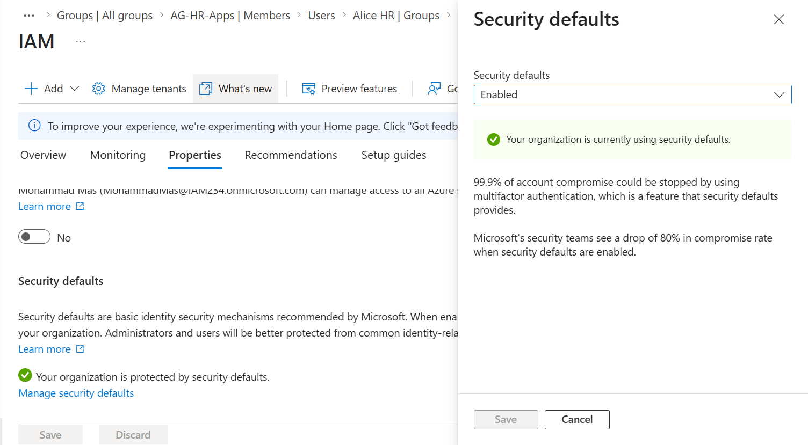
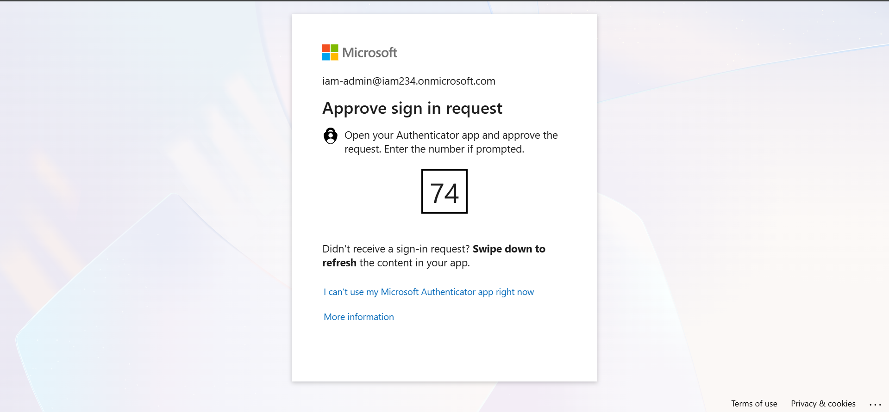
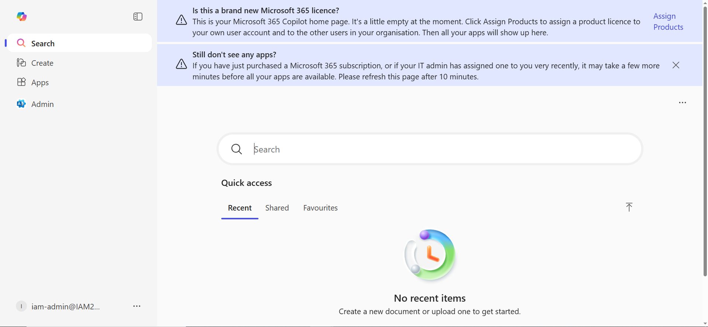

# Phase 5 – Authentication (MFA & Baseline Protection)

## Objective

Implement baseline authentication controls within Microsoft Entra ID to ensure that all identities are strongly verified before accessing resources.

This phase introduces Multi-Factor Authentication (MFA) using Security Defaults to simulate modern identity protection in a low-cost cloud-native environment.

---

## Environment Context

* Organization: Northstar Health
* IAM Platform: Microsoft Entra ID
* Architecture: Cloud-native only
* Security Model: Zero Trust aligned
* Authentication Goal: Strong identity verification

---

## Problem Statement

At the end of Phase 3, users could authenticate using only a password.

This presents a significant risk:

* passwords can be compromised
* phishing attacks can succeed
* attackers can gain unauthorized access

To mitigate this, authentication must require more than one factor.

---

## Core Principle

Authentication must verify identity using:

* something the user knows (password)
* something the user has (device/app)

This is achieved through Multi-Factor Authentication (MFA).

---

## Design Decision

### Use of Security Defaults

Security Defaults were enabled to provide baseline protection without requiring premium licensing.

This enforces:

* MFA registration for users
* MFA requirement for administrators
* blocking of legacy authentication protocols

---

### Identity Considerations

Different identity types were considered:

| Identity Type      | Authentication Requirement        |
| ------------------ | --------------------------------- |
| Workforce Users    | MFA required                      |
| Admin Users        | MFA required (higher sensitivity) |
| Emergency Accounts | Not actively used in this phase   |

Emergency accounts were intentionally left untouched to avoid accidental lockout. These will be properly handled in Phase 5 using Conditional Access.

---

## Implementation

### Step 1 – Enable Security Defaults

Security Defaults were enabled via:

Entra ID → Properties → Manage Security Defaults

---

### Step 2 – Workforce MFA Registration

User tested: `alice.hr@`

On first login:

* prompted to configure MFA
* Microsoft Authenticator selected
* QR code scanned
* authentication verified

---

### Step 3 – Admin MFA Enforcement

User tested: `iam-admin@`

On login:

* MFA registration required
* authentication challenge enforced
* successful login after MFA

---

## Validation

The following validations were performed:

* Security Defaults successfully enabled
* Workforce user prompted for MFA registration
* Admin user required to configure MFA
* MFA enforced on subsequent logins
* No lockout occurred

---

## Authentication Flow

```text
User → Password → MFA Challenge → Access Granted
```

This ensures that identity verification requires more than just credentials.

---

## Screenshots

### Security Defaults Enabled



---

### MFA Registration (Workforce User)



---

### MFA Enforcement (Successful Login)



---

## Failure Scenarios Considered

### No MFA Enforcement

* accounts protected only by passwords
* increased risk of compromise

---

### Misconfiguration Leading to Lockout

* enabling MFA without preparation
* no accessible authentication method
* loss of admin access

---

### Ignoring Break-Glass Accounts

* applying controls without recovery planning
* risk of complete tenant lockout

---

## Key Lessons Learned

* MFA is a fundamental requirement in modern IAM
* authentication is the first security control
* admin accounts require stronger protection
* baseline controls must be implemented before advanced policies
* recovery scenarios must always be considered

---

## Phase Outcome

At the end of this phase, the environment now enforces:

* Multi-Factor Authentication for users
* Multi-Factor Authentication for administrators
* stronger identity verification across the tenant

This establishes a secure authentication baseline for the next phase.

---

## Summary

Phase 5 introduced strong authentication controls using Security Defaults and MFA.

This phase ensures that access is not granted based solely on passwords, significantly reducing the risk of unauthorized access.

This foundation enables the transition to more advanced, policy-driven access controls in Phase 5 (Conditional Access).

